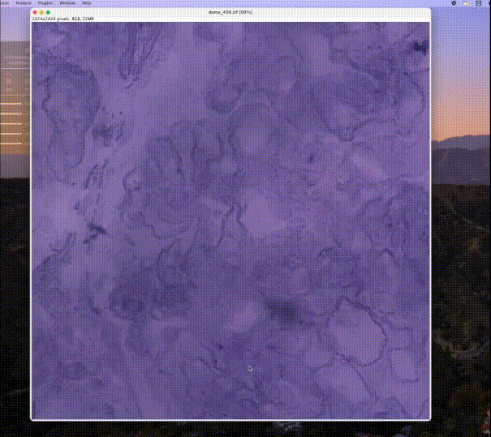

# HistoMagnify — Fiji/ImageJ Plugin for Brightfield Kidney Histology

> Apply learned 20X/40X brightfield deep-learning models, enhance backgrounds, and compute Glomerular Basement
> Membrane (GBM) thickness, process Nearest-Neighbor Distance (NND), 
> and 20X nuclei/RBC counts


<p align="center">
  
  
</p>

---

## Table of Contents

- [Features](#features)
- [Requirements](#requirements)
- [Installation](#installation)
- [Quick Start](#quick-start)
    - [GBM Thickness (40X)](#gbm-thickness-40x)
    - [Process Nearest-Neighbor Distance — NND (40X)](#process-nearestneighbor-distance--nnd-40x)
    - [Nuclei & RBC Counts (20X)](#nuclei--rbc-counts-20x)
- [Settings](#settings)
- [Colors & Labels](#colors--labels)
- [Outputs & Temp Files](#outputs--temp-files)

## Features

- **Brightfield model runner** with auto magnification detection:
    - **20X**: nuclei, RBC, tube, glomerulus, and GBM context
    - **40X**: GBM & podocyte foot processes
- **Background options**:
    - Use **enhanced** or **raw image**
- **Two-slice result**: *Background* + *Overlay* with legend and live **stats banner**
- **Metrics/quant**:
    - **GBM thickness** (40X) with colored skeletons showing the corresponding thickness
    - **Process NND** (40X) with colored lines showing the corresponding distance
    - **Nuclei** and **RBC** counts (20X) with watershedding
- **Calibrations**:
    -   Reads pixel size from metadata or user-provided
    - **Expansion factor (EF)** supported; conversions handled internally
- **Self-contained Python environment for running models**:
    - Creates `~/.histomagnify/venv`, installs `scripts/requirements.txt`


---

## Requirements

- **Fiji/ImageJ** (Fiji recommended for ND2 via Bio-Formats)
- **Java 8+**
- **Python 3.8+** available as `python3` in PATH
  > Windows tip: install the Python Launcher


---

## Installation

### Drop-in JAR

1. Build or download `HistoMagnify_Plugin.jar`.
2. Copy it into `Fiji.app/plugins/`.
3. Restart Fiji/ImageJ -> **Plugins ->  HistoMagnify** appears.

---

## Quick Start

1. **Open** a brightfield TIFF image.
2. **Launch**: `Plugins -> HistoMagnify`.
3. In **HistoMagnify – Apply Segmentation**:
    - Pick the **Source image**
    - Set **TIFF page** (0-based)
    - Choose **Magnification** (**20X** or **40X**)  
      *(auto-detected from metadata/title; you can override)*
    - Toggle **Image is standard processed (skip enhancement)** if your image is already processed
4. Click **OK**. First run bootstraps `~/.histomagnify/venv`, installs deps, and runs the selected model.
5. A **2-slice result** opens: *Background* and *Overlay*, with legend and a bottom **stats banner**.


<p align="center">
  
  
</p>


### Glomerular Basement Membrane (GBM) Thickness

- Menu: `Plugins -> HistoMagnify -> HistoMagnify 40X -> Compute GBM thickness -> GBM - Full image/GBM - ROI`
- Requires a prior **40X** segmentation run.
- If units aren’t real-world (e.g., “pixel”), you’ll be prompted to **Settings** to set **unit** and **units/pixel**.
- Outputs:
    - Visual:
        - Colored dots over GBM skeleton (with the color of the skeleton corresponds to the thickness)
    - Files:
        - `thickness.txt` — mean thickness (in your unit)
        - `thickness_points.csv` — `x,y,local_thickness`

<p align="center">
  
</p>

### Process Nearest-Neighbor Distance (NND) (ACTN4 model must be checked)

- Menu: `Plugins -> HistoMagnify -> HistoMagnify 40X -> Compute process distance -> GBM -> Full image/GBM - ROI`
 Requires **40X** segmentation run.
- Configure **Watershed** params and **size filters** in **Settings**.
- Outputs:
    - Visual:
        - Colored NND **lines** (with the color of the lines corresponds to the distance) + optional **contours**
    - Files:
        - `proc.txt` — mean nearest-neighbor distance (in your unit)
            - `proc_pairs.csv` — `x0,y0,x1,y1` (paired endpoints)
            - Optional contours: `proc_contours.tif`, `proc_outer_contours.tif`
<p align="center">
  
</p>

### Nuclei & RBC Counts (20X)

- Menus:
    - **Nuclei**: `Plugins -> HistoMagnify  -> HistoMagnify 20X -> Count nuclei -> Full image/ROI`
    - **RBC**: `Plugins -> HistoMagnify  -> HistoMagnify 20X -> Count RBCs -> Full image/ROI`
- Requires a prior **20X** segmentation run.
- Outputs:
    - Visual: **original** and **watershed** contours overlaid (Nuclei = **yellow**, RBC = **white**)
    - Files:  
      For nuclei: `nuc_count.txt`, `nuc_labels.tif`, `nuc_contours.tif`, `nuc_outer_contours.tif`  
      For RBC: `rbc_count.txt`, `rbc_labels.tif`, `rbc_contours.tif`, `rbc_outer_contours.tif`

<p align="center">
  
</p>


---

## Settings

Open via `Plugins → MagnifySeg → settings`.

- **Visibility**: legend, GBM skeleton, GBM color bar, process lines, process color bar, process contours
- **Calibration**:
    - Pixel size **unit** and **value** (units/pixel)
    - **Reset to auto** if metadata exists
    - **Image is expanded (apply EF)** and **Expansion factor**
- **Process (Watershed)**:
    - Min distance, peak threshold (0–1), Gaussian sigma
    - Max pair distance (cap)

<p align="center">
  
</p>


---

## Colors & Labels

### 20X classes (overlay LUT)
| Label | Class       | Color (RGB) |
|-----:|-------------|-------------:|
| 1    | Nucleus     | (91, 24, 199) |
| 2    | RBC         | (242, 91, 96) |
| 3    | Tube        | (240, 203, 73) |
| 4    | Glomerulus  | (89, 195, 71) |
| 5    | GBM         | (76, 98, 246) |

### 40X classes (overlay LUT)
| Label | Class                         | Color (RGB) |
|-----:|-------------------------------|------------:|
| 1    | GBM                           | (255, 0, 255) |
| 2    | Podocyte foot processes       | (0, 255, 255) |

**Colorbars**: **Viridis** for GBM thickness; **Hot** for process NND.

---

## Outputs & Temp Files

Per-run files live in a temp directory, e.g.:

```
/tmp/histomagnify_XXXXXXXX/
  input_page_raw.tif
  enhanced.tif
  seg_20x.tif                # when 20X selected
  seg_40x.tif                # when 40X selected
  # 40X GBM thickness:
  gbm_mask.tif
  thickness.txt
  thickness_points.csv
  # 40X process NND:
  proc_mask.tif
  proc.txt
  proc_pairs.csv
  proc_labels.tif
  proc_contours.tif
  proc_outer_contours.tif
  # 20X counts:
  nuc_mask.tif
  nuc_count.txt
  nuc_labels.tif
  nuc_contours.tif
  nuc_outer_contours.tif
  rbc_mask.tif
  rbc_count.txt
  rbc_labels.tif
  rbc_contours.tif
  rbc_outer_contours.tif
```
